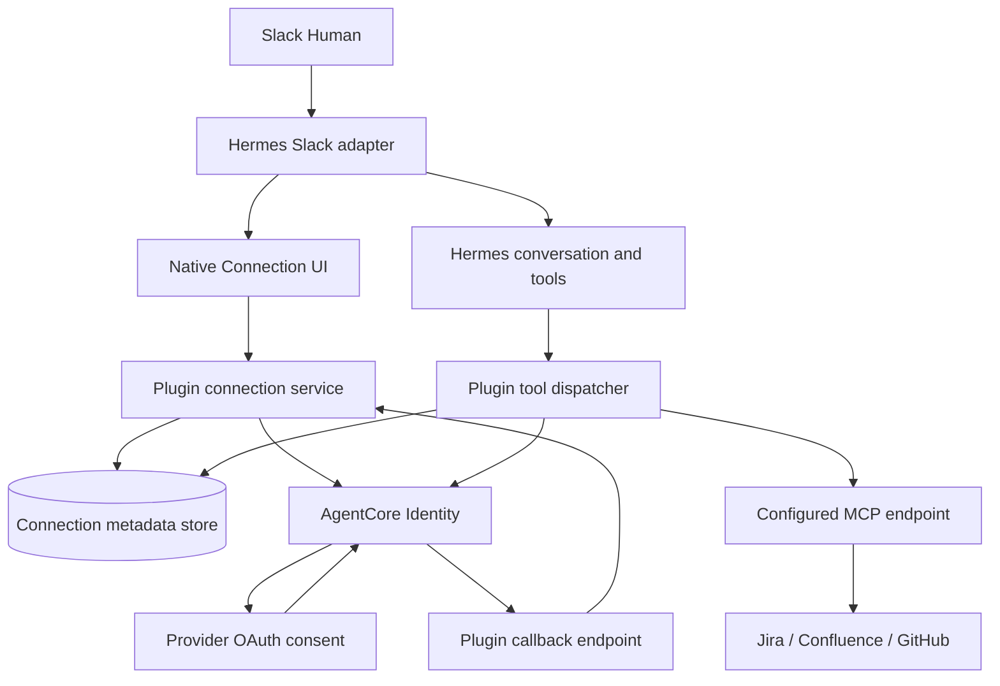

# Hermes AgentCore Plugin Technical Design

Status: Proposed，尚未實作或完成 live integration 驗證

Updated: 2026/09/08 UTC+8

## Goal

讓既有 Hermes 使用者安裝 Plugin 後，可以在 Slack 連接自己的第三方帳號，透過 AWS AgentCore 使用 Jira、Confluence、GitHub，並能從原生介面停止使用連接

執行路徑完全不依賴 OpenAB，保留既有 Hermes gateway、config、skills、memory、model routing 與 runtime scripts

安裝 Plugin 仍需要新增 Plugin 設定、AWS IAM 權限，以及可能的 Slack App 設定，保留既有行為不代表零設定，也不代表模型輸出能逐字一致

## Acceptance Boundary

- OAuth lifecycle 由程式處理，Connect、callback、confirmation、Disconnect 不依賴 LLM
- Authorization URL、OAuth state、confirmation code、access token、refresh token 不進入模型 context、工具結果或對話紀錄
- Slack identity 來自可信 adapter context，不能由 prompt、tool argument 或 memory 指定
- 每個工具呼叫綁定發起者，不能使用其他人的 credential
- Provider token 不持久化，短暫存在受信任 Plugin process 記憶體中的風險已接受
- Disconnect 先阻止新的使用，再分別回報遠端清理結果
- 不修改既有部署作為開發測試，先使用隔離的 Hermes home、Slack 測試 App 與測試資料

## Architecture



圖中的 MCP endpoint 必須明確區分 direct provider MCP 與 AgentCore Gateway，只有實際走 Gateway 的呼叫才能主張 Gateway Policy 已套用

Plugin 不需要 OpenAB binary、image、ACP process 或服務 endpoint

## Technology Choices

| Component | Choice | Reason / Constraint |
| --- | --- | --- |
| Plugin | Python，使用 Hermes 官方 Plugin packaging | 獨立 repo 與 release，具體 manifest、entry point 以目標版本 source 為準 |
| AWS client | Boto3 / Botocore | 使用官方 SDK，版本依所需 AgentCore API 固定並測試 |
| AWS credentials | SDK default credential chain | 部署優先使用 IAM role，不寫死 AWS_PROFILE 或 access key |
| MCP transport | 優先使用 Python MCP SDK | 先確認 Hermes native MCP client 是否能安全隔離 per-user credential，禁止共用可變 Authorization header |
| Metadata | SQLite，獨立 Plugin 資料目錄 | 初版單 process、單 instance，交易與 generation 控制連接狀態 |
| Native UI | Slack App Home、Block Kit、modal | 需要 Hermes 暴露可信互動事件與 Slack client，尚待 source 驗證 |
| Callback | 獨立 route 的小型 HTTP handler | HTTP framework 待驗證 Hermes server extension 後決定，可由 HTTPS reverse proxy 對外提供 |
| Tests | pytest、fake AWS/MCP clients、Hermes integration tests | 驗證身份隔離、OAuth lifecycle、錯誤處理與原有行為 |

SQLite 只存非 provider-token 狀態，並不因此變成不敏感資料，仍限制檔案權限與日誌內容

## Compatibility Gate

參考環境的配置指定 Hermes `v2026.8.31`，目前只確認配置內容，尚未確認 live runtime 的 image digest、patches 或 Plugin API

實作前需取得對應 upstream/fork source，記錄 commit 與 image provenance，避免直接依賴最新版文件

| Question | Evidence Required | If Missing |
| --- | --- | --- |
| Plugin 如何載入與註冊 command/tool | 目標版本 Plugin loader、範例與測試 | 調整 packaging，不猜 API |
| 能否取得 workspace/member | Slack adapter 至 Plugin 的實際 event/context | 提議通用可信 identity extension |
| Hook 位於驗證前還是後 | Slack authorization 與 dispatch 呼叫順序 | 不把 pre_gateway_dispatch 名稱當成已驗證身份的證據 |
| App Home、block_actions、view_submission 能否攔截 | Socket Mode / HTTP handlers 與 Plugin extension | 提議 native interaction extension，不以聊天模擬授權 |
| 工具是否有 request-scoped context | tool dispatcher、thread/subagent lifecycle | 缺少身份時拒絕呼叫，不退回共用帳號 |
| Native UI 是否寫入 history | transcript、memory、telemetry 路徑 | 隔離 native events 與 agent context |
| 既有 MCP client 是否共用 token/session | MCP connection pool 與 auth 實作 | 使用 Plugin 自己管理且隔離的 MCP client |

如果純 Plugin API 不足，先列出可重現的缺口與最小 core extension，記錄 compatibility decision 後再實作，不宣稱可以無修改安裝

## Identity

Canonical subject 格式

```text
slack:<workspace_id>:<member_id>
```

從可信 Slack event 與 App installation context 取得 ID，验证兩者一致，不信任訊息文字、顯示名稱、模型記憶或 tool arguments

每次 invocation 建立 immutable context，包含 subject、workspace、member、conversation 與 request ID，thread ID 只用於對話路由，不取代使用者身份

Connection key 至少包含 subject 與 provider connection ID，AgentCore workload 與 deployment namespace 也要明確隔離

同一 thread 的不同發言者各自使用自己的 identity，子 Agent 必須繼承已驗證的 invocation context，無法可靠繼承時停用該路徑

排程或背景任務沒有互動 Human，第一版不替這些工作推測身份

Groups 不能由 LLM 指定，也不從顯示名稱推導，第一版不自動授予 privileged groups

## Connection Lifecycle

| State | Meaning | Native Action |
| --- | --- | --- |
| disconnected | Plugin 禁止使用此連接 | Connect |
| connecting | 等待 OAuth 或必要的 Human confirmation | Cancel / Resume |
| connected | Plugin 已完成綁定，允許嘗試授權內的工具 | Disconnect / Check |
| disconnecting | 已關閉新的 dispatch，遠端清理進行中 | Status |

授權狀態與服務健康分開存放，connected 不保證所有工具都有 scope 或服務正常，MCP timeout 不能直接被解釋為 OAuth 失效

### Connect

1. Human 從原生 UI 按 Connect，程式驗證 Slack sender 與 connection allowlist
2. 以 transaction 建立新的 generation 與短期 pending session
3. 呼叫 AgentCore workload identity 與 resource OAuth API，確切參數以 SDK/source 驗證
4. Authorization URL 僅交給 native renderer，使用私人或 per-user UI，不放進公共 thread
5. Human 在 provider 同意後，provider 回到 AgentCore provider callback
6. AgentCore 導回 Plugin 的 application return endpoint
7. Callback 驗證 pending session、有效期、generation 與一次性狀態
8. 若協定需要確認 Human，使用原生 modal 完成，從 Slack event 再次驗證 subject
9. 完成綁定後更新狀態，讓 Human 明確重試原本工具，第一版不自動重播先前寫入操作

AgentCore provider callback 與 Plugin application return URL 是兩個不同 endpoint，不可互換

OAuth state 與 confirmation code 使用不同隨機值，確認碼只存 hash，具有短期效期與一次性使用限制

Pending URL 與 OAuth session 資料初版保留在記憶體，process restart 後 pending session 失效，UI 要能重新開始，不能假裝已完成

### Tool Execution

1. LLM 提交業務工具名稱與業務參數，schema 不包含 subject、token、authorization URL 或任意 endpoint
2. Dispatcher 取得可信 invocation identity，檢查連接狀態與 generation
3. 使用該 subject 向 AgentCore 取得 credential
4. 若 API 回傳需要授權，Plugin 丟棄或保留在 native-only 邊界內處理 URL，模型只收到固定的 connection_required 狀態
5. 只向設定允許的 HTTPS endpoint 送出 token，禁止自動把 Authorization 轉送至不同 origin
6. 開始 downstream request 前重新檢查 generation，確保 Disconnect 之後不啟動新的呼叫
7. MCP result 經錯誤分類與敏感欄位處理後才回到 Hermes

業務工具可由模型選擇，授權 lifecycle 不可由模型操作

AgentCore 讀 token 的 API 是否可能隱含建立 OAuth session 需實測，必要安全要求是敏感授權資料永遠不交給 LLM，不能在未驗證前承諾 AWS 端絕不產生 session

### Disconnect

1. 驗證 native interaction 的 subject 與 connection
2. Transaction 先設定 disconnected 並增加 generation，立即拒絕後續 dispatch
3. 取消 pending authorization，舊 callback 與確認碼失效
4. 清除 Plugin 管理的短期 credential/client 狀態
5. 如 AWS 或 provider 有已驗證的清理 API，再執行遠端清理
6. 分別回報 Plugin 已停止使用，以及遠端撤銷成功、失敗或不支援

已發出的第三方 request 可能完成，Disconnect 不承諾撤回既有操作

不使用刪除整個 credential provider 的方式斷開單一使用者，也不把 forceAuthentication 等參數直接當成正式 revoke API

## Token and Process Boundary

Access token、workload token 僅限受信任 Plugin code 短暫使用，不落地、不輸出、不放入 child process env 或 command line，不做跨使用者 cache

Python 無法保證字串從記憶體立即清零，不宣稱此設計能抵抗 process compromise

Hermes 的 terminal 與 code execution 能力可能以同一 OS user 執行任意程式，Plugin 的邏輯邊界不等於 OS security boundary，必須確認執行環境對 process、檔案與 AWS role 的可見性

若要防止 agent 執行的程式直接取得 AWS credential，需要額外 sandbox、獨立 OS identity 或 credential broker，這是 compatibility/security gate，不能只靠 Plugin API 的欄位隱藏解決

## Gateway and Policy

第一版先使用單一唯讀 Jira operation 驗證 per-user Identity 路徑

每個 connection 明確宣告 downstream 類型與 endpoint，direct Atlassian MCP 的成功只證明 Identity 與該 provider 路徑

Gateway integration 另外驗證 inbound authentication、可信 claim、outbound credential 與 Policy attachment，subject 字串或 groups 放入 request body 不等於可信 Policy identity

只有驗證 allow、deny 與身份冒用測試後，才能宣稱 AgentCore Policy 有效，deny 時不可 fallback 到 direct MCP 繞過 Gateway

## Error and Audit Contract

模型可見錯誤使用有限分類，例如 connection_required、permission_denied、service_unavailable、invalid_arguments

模型結果不得包含 SDK raw response、HTTP Authorization header、完整 OAuth URL 或 callback query，原生 UI 也不得把這些資料注入對話 history

Audit 保留 request ID、connection ID、事件類型、結果與必要的 subject 識別，避免寫入業務全文，callback access log 必須去除 query string

Status 查詢不得為了顯示 UI 自動啟動 Connect，native events 不觸發 model fallback

## Delivery Plan

| Phase | Deliverable | Exit Criteria |
| --- | --- | --- |
| 0 | 目標 Hermes source/API 稽核 | 已確認支援面、缺口、version/commit，決定純 Plugin 或最小 extension |
| 1 | Plugin skeleton、可信 identity、native UI、fake backend | 授權事件不呼叫 LLM，普通對話行為保留 |
| 2 | Boto3 Identity、callback、metadata state machine | 隔離環境完成 Connect、Check、Disconnect，token 不落地 |
| 3 | 唯讀 Jira MCP invocation | 兩個 Human 各用自己的授權，斷開互不影響 |
| 4 | Gateway/Policy 驗證與安裝文件 | 明確列出已驗證的工具路徑、deny 與部署要求 |

在 live proof 前不移除既有部署，不將尚未驗證的功能標示為 production ready

## Test Matrix

- 兩位 Human 同時操作、同一 thread 不同發言者、不同 workspace 相同 member 字串均保持隔離
- Prompt 或 tool argument 偽造 subject 不影響實際 identity
- 缺少可信 context 時 fail closed
- Connect、Resume、Cancel、confirmation、Status、Disconnect 路徑使用會在被呼叫時失敗的 model stub，證明無模型調用
- 使用合成 canary URL/code/token 檢查模型輸入、history、memory、tool results、logs 與 telemetry
- Callback replay、過期、錯誤 subject、舊 generation 與 Disconnect race 均被拒絕
- Process restart 後 disconnected 狀態保留，pending session 不被誤認為 connected
- MCP session、headers 與 connection pool 不跨 subject 串用
- SDK 失敗、MCP timeout、scope 不足保持正確分類，無無限重新授權
- Disconnect 後新呼叫被拒絕，另一個使用者仍可使用
- Gateway deny 不走 direct fallback
- 原有 config、skills、memory 與 model routing 在隔離 Hermes home 的回歸案例中仍生效

## Open Questions

- 目標 Hermes 版本的 native Slack extension、tool context 與 subagent propagation 是否足夠
- AgentCore 現行 per-user disconnect/revocation primitive 的實際語意
- MCP transport 的 auth refresh 與 server-side session 是否需要 per-user client
- Callback hosting 如何整合既有 ingress，pending session 的 origin binding 如何實作
- Hermes tools 的 sandbox 是否符合已接受的 credential threat model
- 後續多 replica 的 metadata store、locking 與 callback routing，初版不支援直接擴成多 instance

## References

以下作為設計參考，main branch 文件不代表目標版本已支援，Phase 0 必須补上實際 source permalinks

- [Hermes Plugin 開發文件](https://github.com/NousResearch/hermes-agent/blob/main/website/docs/developer-guide/plugins/index.md)
- [Hermes Plugin 功能文件](https://github.com/NousResearch/hermes-agent/blob/main/website/docs/user-guide/features/plugins.md)
- [Hermes Hooks](https://github.com/NousResearch/hermes-agent/blob/main/website/docs/user-guide/features/hooks.md)
